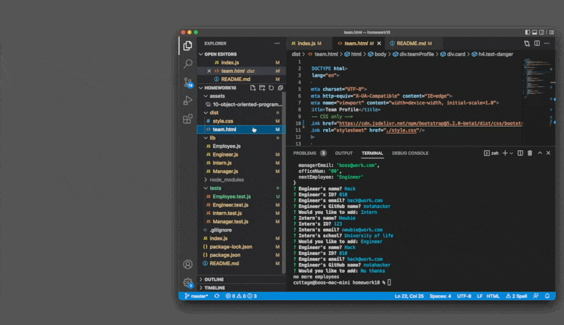

# 10 Team Profile Generator

### The Project

To build a Node.js command-line application that lets the leader of a team build their member through a command-line. Those responses will be rendered onto a HTML webpage that displays summaries for each person. The project will also have a unit test for some code lines to make sure they passes each test.

### User Story

```md
AS A manager
I WANT to generate a webpage that displays basic information about my team
SO THAT I can quickly know who they are and quickly grab their info
```

### Application Outline

```md
GIVEN a command-line application that accepts user input
WHEN I run 'node index'
THEN I am met with a set of listed prompts for my team members and their information
WHEN I am entered the manager's name, id, email, and office number
THEN I am presented with a prompt with the option to add an engineer or intern as an additional member, or finish the roster
WHEN I select an engineer
THEN I am prompted to enter the engineer’s name, ID, email, and GitHub username, and I am taken back to the options again
WHEN I select an intern
THEN I am prompted to enter the inter's name, ID, email, and school name, and I am taken back to the options again
WHEN I select to finished with the prompts
THEN an HTML file is generated to displays those answers in a nicely formatted way
WHEN I click on an email address in the HTML
THEN my default email program opens and populates the TO field of the email with the address
WHEN I click on the GitHub username in the HTML
THEN that GitHub profile opens in a new tab
```

### Preview

The following images show the web application's appearance and functionality:
<a href="https://drive.google.com/file/d/1SLODOwGTGnEMiefLI8U4twe9-EiuBf0B/view?usp=sharing" target="_blank">Link to video demo</a>

Here are more visual demonstrations of the working application:





### Credits

* Uses [Inquirer](https://www.npmjs.com/package/inquirer) for prompts
* Use [Jest](https://www.npmjs.com/package/jest) for unit test
* Huge thanks to Wilson Lam, Nolan Spencer, Angie Soto, and Luigi Campbell